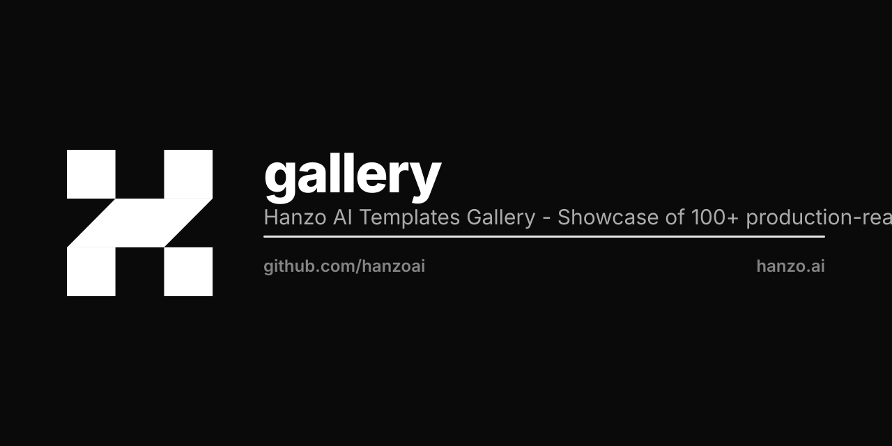

<p align="center"></p>

This is a [Next.js](https://nextjs.org) project bootstrapped with [`create-next-app`](https://nextjs.org/docs/app/api-reference/cli/create-next-app).

## Getting Started

First, run the development server:

```bash
npm run dev
# or
yarn dev
# or
pnpm dev
# or
bun dev
```

Open [http://localhost:3000](http://localhost:3000) with your browser to see the result.

You can start editing the page by modifying `app/page.tsx`. The page auto-updates as you edit the file.

Type is Zen, the Hanzo family, from the `@hanzo/font` package. `app/layout.tsx`
imports `@hanzo/font/css` — @font-face and the `--font-zen-*` names — and
`app/globals.css` binds those to `--font-sans` / `--font-mono`. No font is
fetched at build or at run time.

## Learn More

To learn more about Next.js, take a look at the following resources:

- [Next.js Documentation](https://nextjs.org/docs) - learn about Next.js features and API.
- [Learn Next.js](https://nextjs.org/learn) - an interactive Next.js tutorial.

You can check out [the Next.js GitHub repository](https://github.com/vercel/next.js) - your feedback and contributions are welcome!

## Deploy on Hanzo

[](https://hanzo.app/new?template=https://github.com/hanzoai/gallery)

One click provisions this app on Hanzo Cloud; every template in the gallery carries the same badge on its page.

Licensed under **MIT OR Apache-2.0**, per [HIP-0137](https://github.com/hanzoai/hips/blob/main/HIPs/hip-0137-one-license.md).
